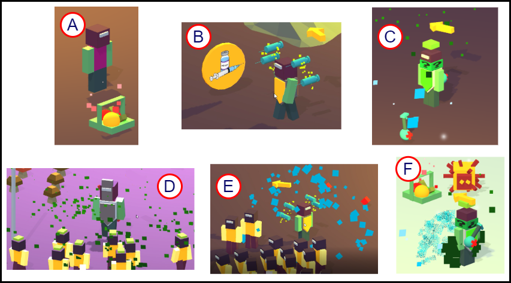
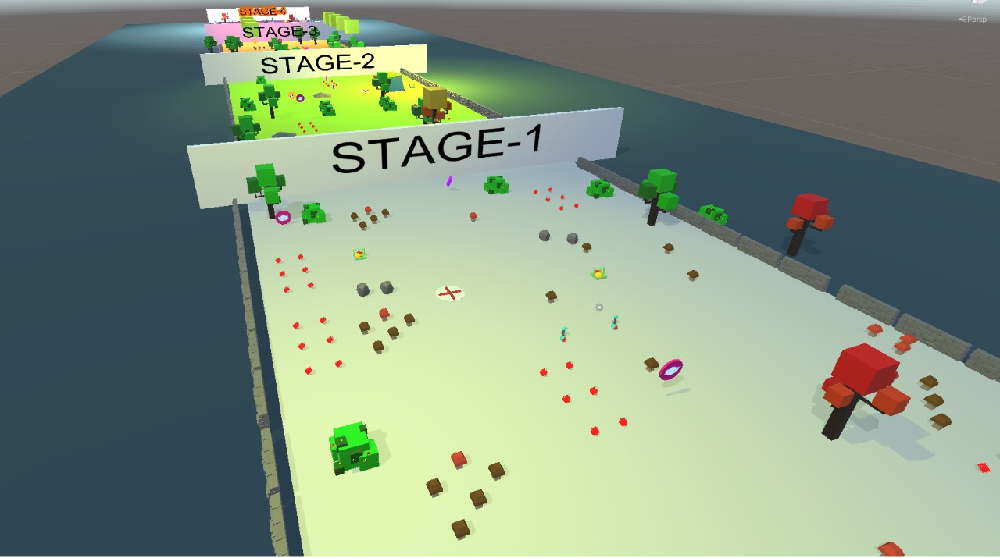
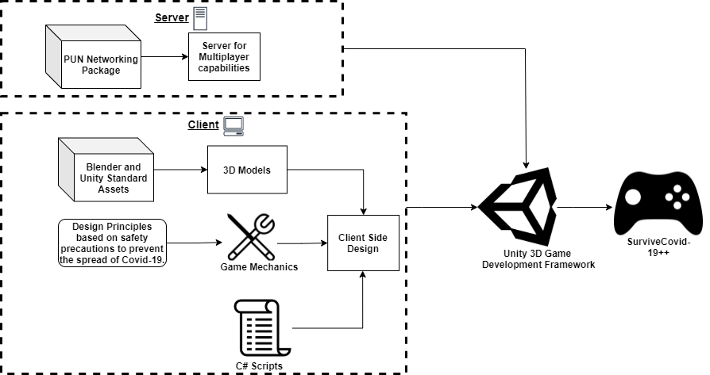

  
  

# SurviveCovid19++

## What is SurviveCovid-19?
1. SurviveCovid19 is a collaborative healthcare game towards educating people about safety measures and vaccination for Covid-19
2. The code from this repository can be used to build all the Web, Desktop and Android versions of SurviveCovid19.

## Features of SurviveCovid-19:
1. Infection spreads by contact hence enforcing the notion of social distancing.
2. Masks and Sanitizers control the spread of Virus.

  

  

## Uses of SurviveCovid-19:
SurviveCovid-19 has been developed to educate about, and motivate public to follow safety measures to be taken to control Covid-19 pandemic, as an Android and Web based mobile  game.

## Steps to build the game:
1. Download the repository on your local machine.  
2. Create a new Unity 3D application.
3. Copy the folders from inside of the SurviveCovid19 folder into the application. 
4. Replace any necassary folders.
5. Use appropriate build settings to generate the game. 

  

## Demonstration Video of SurviveCovid-19:
The demonstration video can be found on Youtube using the following link:
https://youtu.be/j8lCtnx2MHg

## How to contribute to SurviveCovid19
We will be very happy to receive any kind of contributions. Incase of a bug or an enhancement idea or a feature improvement idea, please open an issue or a pull request. Incase of any queries or if you would like to give any suggestions, please feel free to contact Dheeraj Vagavolu (cs17b028@iittp.ac.in), Akhila Sri Manasa Venigalla (cs19d504@iittp.ac.in) or Sridhar Chimalakonda (ch@iittp.ac.in) of RISHA Lab, IIT Tirupati, India.
